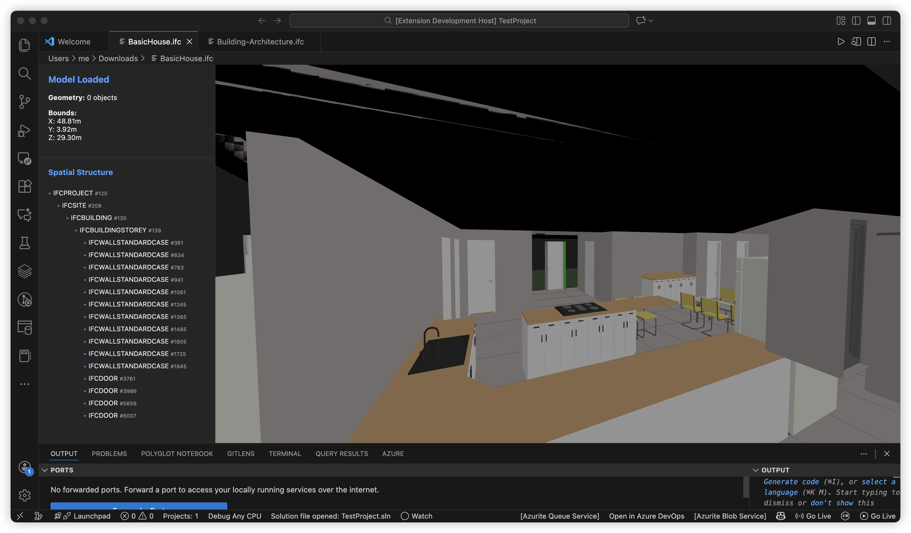

# IFC VS Code Viewer

A Visual Studio Code extension that allows you to view IFC files directly within VS Code using [That Open Engine](https://github.com/ThatOpen/engine_components).

## Features

- **IFC Viewer**: Open `.ifc` files in a high-performance 3D viewer.
- **3D Navigation**: Orbit, pan, and zoom to inspect your BIM models.
- **Model Properties**: View basic model information in the sidebar.
- **Split Layout**: Adjustable sidebar and viewer area.

## Usage

1.  Install the extension.
2.  Open any `.ifc` file in VS Code.
3.  The viewer will automatically load and display the model.
4.  Use the sidebar to view model properties.

## Requirements

- VS Code 1.74.0 or higher.

## Development

1.  Clone the repository.
2.  Run `npm install`.
3.  Run `npm run compile` to build the extension and webview.
4.  Press `F5` to start debugging.
